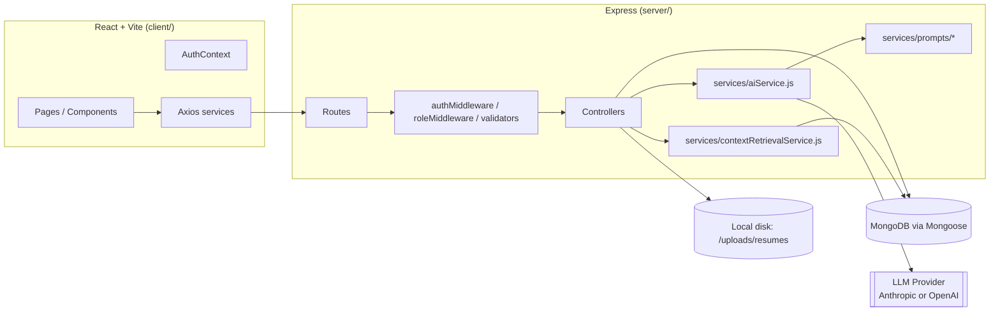

# AI Career & Job Tracker

A full-stack MERN application that helps job seekers manage applications, analyze resumes against job descriptions, close skill gaps, and prepare for interviews — with AI integrated into real workflows, not a bolted-on chatbot.

---

## 1. Project overview

AI Career & Job Tracker combines a job-application CRM (Kanban board, analytics dashboard) with AI-powered career tooling: resume parsing, resume-to-job matching, ATS compatibility estimation, resume rewriting suggestions, skill-gap roadmaps, AI-generated interview questions with live feedback, and a contextual career assistant that answers questions using the user's own stored data.

## 2. Features

**Candidate**
- Register/login, profile with education/experience/skills/target roles
- Upload PDF resumes, AI-parse into structured data, set a primary resume
- Add/search/filter/sort jobs; Kanban board (Saved → Applied → Screening → Assessment → Interview → Offer/Rejected/Withdrawn)
- AI job-description analyzer, resume-job match scoring, AI-based ATS estimate, AI resume-section rewriting (fact-preserving), skill-gap analysis with a learning roadmap
- AI-generated interview questions (HR/Technical/Project/DSA/SQL/System Design/Behavioral), a full mock-interview practice flow with per-answer AI feedback and aggregate scores
- Contextual AI career assistant (uses the user's real resume/application/interview data)
- Job recommendations scored against stored jobs
- Notifications, dashboard analytics (6 charts + 8 summary stats)

**Admin**
- Platform stats, user management (enable/disable), predefined skills catalog, AI usage monitor

## 3. Architecture



**Request flow for an AI feature (e.g. resume-job match):**
`client → axios (JWT attached) → route → authMiddleware → validator → controller → aiService.callAI() (prompt + LLM call, JSON-validated, retried on transient failure) → result persisted to MongoDB → response`

## 4. Tech stack

- **Frontend:** React, Vite, React Router, Axios, Tailwind CSS, Recharts, React Hook Form, Lucide React, React Toastify
- **Backend:** Node.js, Express, MongoDB, Mongoose, JWT, bcryptjs, Multer, express-validator, Helmet, CORS, Morgan, express-rate-limit, express-mongo-sanitize
- **AI:** provider-agnostic HTTP calls (Anthropic Messages API or OpenAI Chat Completions), selected via `AI_PROVIDER` env var

## 5. AI architecture

All AI calls go through **`server/services/aiService.js`** — the single entry point every feature uses. It:
- Reads `AI_PROVIDER` / `AI_API_KEY` / `AI_MODEL` from environment variables — no key is ever hard-coded
- Sends a strong system prompt (from `server/services/prompts/*.js`) that explicitly forbids fabricating candidate facts
- Requests structured JSON output and validates/parses it before returning
- Retries once with a stricter instruction on invalid JSON or a transient (5xx) provider error; throws a typed `ApiError` otherwise
- Every call is logged (feature name, success/failure, duration — never prompt/response bodies) to `AiUsageLog` for the admin usage monitor

**RAG / Career Assistant:** `server/services/contextRetrievalService.js` retrieves and ranks the user's own resume, applications, match analyses, and interview history into a compact context block, which is passed to the LLM alongside the user's question. This module is intentionally isolated so it can be swapped for real embedding + vector search (MongoDB Atlas Vector Search, Pinecone, pgvector) later without touching `aiController.js`.

**Anti-fabrication guardrails:** every prompt instructs the model to say "insufficient information" rather than guess, and resume-improvement prompts explicitly forbid inventing metrics, employers, or technologies.

## 6. Database schema

9 Mongoose models: `User`, `Resume`, `Job`, `JobApplication`, `ResumeAnalysis`, `InterviewSession`, `Skill`, `Notification`, `AiUsageLog` — see `server/models/*.js` for full field definitions, enums, and indexes. All user-owned collections are indexed on `userId` (plus compound indexes for common queries) and every controller enforces that a user can only read/write their own documents.

## 7. API documentation

All responses follow `{ success, message, data }` (or `{ success: false, message }` on error).

| Method | Route | Description |
|---|---|---|
| POST | `/api/auth/register` | Register (role always `candidate`) |
| POST | `/api/auth/login` | Login |
| POST | `/api/auth/logout` | Logout (client discards JWT) |
| GET | `/api/auth/me` | Current user |
| PUT | `/api/auth/change-password` | Change password |
| GET/PUT | `/api/users/profile` | View/update profile |
| POST/GET | `/api/resumes`, `/api/resumes/upload` | Upload & list resumes |
| GET/DELETE | `/api/resumes/:id` | Resume detail / delete |
| PUT | `/api/resumes/:id/primary` | Set primary resume |
| POST/GET | `/api/jobs` | Create / search+filter+sort+paginate jobs |
| GET/PUT/DELETE | `/api/jobs/:id` | Job detail / update / delete |
| POST/GET | `/api/applications` | Create / list applications (Kanban) |
| GET/PUT/DELETE | `/api/applications/:id` | Application detail / update status / delete |
| GET/DELETE | `/api/interviews`, `/api/interviews/:id` | List / view / delete mock interview sessions |
| POST | `/api/ai/parse-resume` | AI resume parsing → structured JSON |
| POST | `/api/ai/analyze-job` | AI job description analyzer |
| POST | `/api/ai/match-resume` | AI resume-job match score + gaps |
| POST | `/api/ai/ats-analysis` | AI-based ATS compatibility estimate |
| POST | `/api/ai/improve-resume` | AI section rewrite (fact-preserving) |
| POST | `/api/ai/skill-gap` | Skill gap + learning roadmap |
| POST | `/api/ai/interview-questions` | Generate a mock interview session |
| POST | `/api/ai/interview-feedback` | Score one answer, update session |
| POST | `/api/ai/chat` | Contextual career assistant (RAG) |
| GET | `/api/recommendations` | Job recommendations from stored jobs |
| GET/PUT | `/api/notifications` | List / mark read |
| GET | `/api/analytics/dashboard` | All dashboard stats + 6 charts |
| GET/PUT | `/api/admin/*` | Platform stats, users, skills, AI usage (admin only) |

## 8. Installation

```bash
git clone <this-repo>
cd ai-career-tracker
cd server && npm install
cd ../client && npm install
```

## 9. Environment setup

Copy `server/.env.example` to `server/.env` and fill in:

```
MONGO_URI=mongodb://localhost:27017/ai-career-tracker
JWT_SECRET=<long random string>
AI_PROVIDER=anthropic        # or "openai"
AI_API_KEY=<your key>        # required for every AI feature to function
AI_MODEL=claude-sonnet-4-6
CLIENT_URL=http://localhost:5173
```

Copy `client/.env.example` to `client/.env` (sets `VITE_API_URL`).

## 10. Running locally

```bash
# Terminal 1
cd server && npm run dev      # http://localhost:5000

# Terminal 2
cd client && npm run dev      # http://localhost:5173
```

## 11. Seed data

```bash
cd server && npm run seed
```

Creates a skills catalog, 3 users, 4 jobs, and 4 applications across different pipeline stages.

**Sample login credentials:**
| Role | Email | Password |
|---|---|---|
| Admin | admin@careertracker.dev | Admin@1234 |
| Candidate | priya@careertracker.dev | Candidate@1234 |
| Candidate | rahul@careertracker.dev | Candidate@1234 |

## 12. Testing

```bash
cd server && npm test
```

`tests/auth.test.js` covers registration, duplicate-email rejection, weak-password rejection, login (success/failure), `/auth/me` with and without a token, and profile updates, using `mongodb-memory-server`. **Note:** if your environment blocks downloading the in-memory MongoDB binary (as this sandboxed build environment does), point `MONGO_URI` at a real local MongoDB instance instead and adapt the test's `beforeAll`/`afterAll` accordingly, or run the tests in an environment with open network access.

## 13. Deployment

- **Backend:** any Node host (Render, Railway, Fly.io, EC2). Set all `server/.env.example` vars in the platform's environment settings. Point `MONGO_URI` at MongoDB Atlas for production.
- **Frontend:** any static host (Vercel, Netlify, Cloudflare Pages). Set `VITE_API_URL` to your deployed backend URL. Run `npm run build` and deploy `client/dist`.
- **File storage:** resumes are stored on local disk under `server/uploads/resumes` — for multi-instance deployments, swap this for S3/Cloud Storage (only `uploadMiddleware.js` and the file-serving path in `resumeController.js` would need to change).
- **Reminders:** `server/utils/generateReminders.js` populates interview/deadline notifications but isn't scheduled automatically — wire it to your platform's cron/scheduled-job feature.

## 14. Known limitations

- No live external job board integration — recommendations are scored only against jobs already stored in the app.
- The RAG/career-assistant context retrieval is keyword-ranked over the user's own MongoDB documents, not a real vector database (by design — see AI architecture above for the swap-out plan).
- No websocket/real-time layer — the notification bell polls every 60s.
- Reminder generation requires an external scheduler; nothing runs it automatically.
- PDF parsing requires a text layer; scanned image-only PDFs will fail with a clear error rather than silently producing garbage.
- Automated test coverage currently covers auth flows only; job/application/AI-endpoint tests are a natural next addition.

## 15. Future improvements

- Real vector search for RAG (MongoDB Atlas Vector Search or similar)
- WebSocket-based live notifications
- Cloud object storage for resumes
- Expanded automated test suite (jobs, applications, AI endpoint validation, authorization boundaries)
- Code-splitting the frontend bundle (currently a single ~250KB gzipped chunk)
- Optional live job-board connector for recommendations
